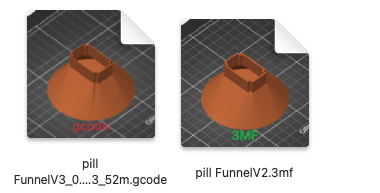
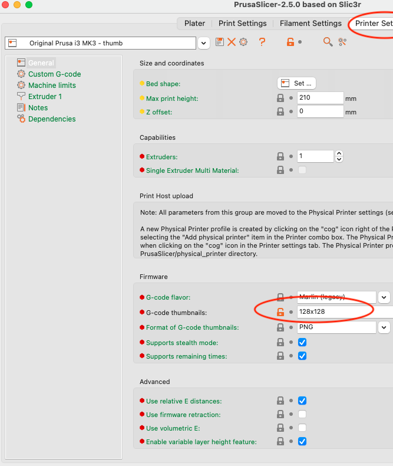

# ThumbHost3mf
A macOS app that hosts a thumbnail provider that makes the Finder displays the thumbnails built in to some .gcode and .3mf files.

I got tired of my gcode and 3mf files looking like 

 when they could look like this: 

To Install:

* Download and run the ThumbHost3MF. If you don't want to compile it yourself, grab the compiled code from [Releases](https://github.com/DavidPhillipOster/ThumbHost3MF/releases/tag/1.0)

* To compile it yourself, use your team and domain name. I uploaded this as com.example, but in the release I signed it with my team and domain name.

To get previews in your GCode files, in PrusaSlicer, in Printer Settings, set the thumbnail size to something reasonable. (I use 128x128, but you may need other sizes.)

   

This will cause PrusaSlicer to append a base64-encoded 128x128 .png image of the gcode to near the start of the gcode file.

* You may need to use ThumbHost3MF's **Open** command to let the Finder know that it has a thumbnail provider.

* You may find that the Finder has made ThumbHost3MF the default app for .3mf and .gcode files. If that happens, in Finder, do a Get Info any .3mf and .gcode file and set the default app to what you wish.

I'm posting this to get early feedback. In an ideal world, the thumbnail provider would be inside the PrusaSlicer app and  this app would not be necessary. If this app does not break the world, I'll work on submitting a pull request on PrusaSlicer.

In the `Original Prusa Drivers 2.5.0` distribution, in the `Sample Objects`  subdirectory, the `MK3_MK3S_MK3S+/3MF` folder has .3mf files with embedded thumbnails, but the `MINI_MINI+/3MF` files do not. 

If you open the `MINI_MINI+/3MF` files and **Save** them, PrusaSlicer adds the thumbnails.

## License

Apache 2 [License](LICENSE)

